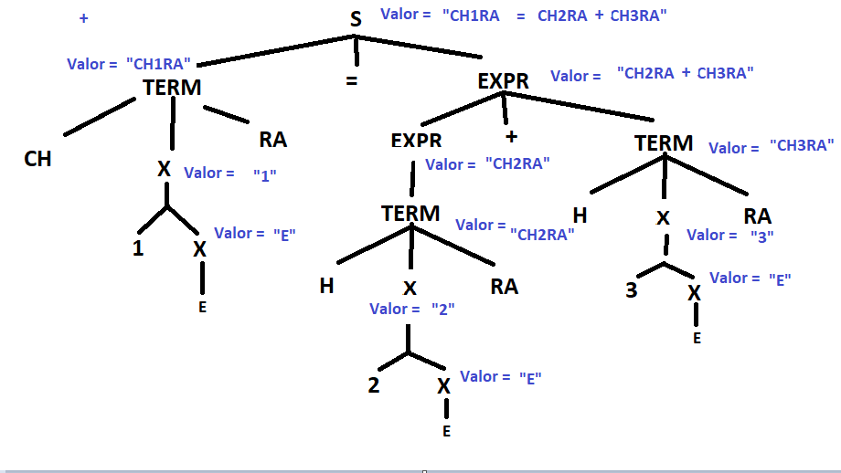

# Notas
## 07/02/2023

Operaón de las asignaciones la utilizaremos para evaluar el sintaxis y las reglas 

Sintaxis | Ejemplo
--- | ---
----|----

## 09/02/2023

El día de hoy se hizo el programa de Expresion.py en el se tenia que escribir la expresión regular de nuestras variablese para después esetablecerlas en python. 

```python
import re
# Expresión regular RA(0-9UA-ZU_)*RA
p = re.compile(r"""\ACH([0-9]*[A-Z]*_*)RA\Z""")
# En la cual para poder colocar más de una U (unión) se tuvo que poner las tres comillas y la letra r ya que daba un error de coincidencia el cual no es correcto
palabra = 'CHA_RA'
m = p.match(palabra)

if m is None:
    print('No valida')
else:
    print('Es valida')

print(m)

```

Lo que el programa debe de hacer es: 

Código: 
int hola, perro, loco;

Lexema | Tipo
--- | ---
int | 
hola |
perro |
loco |

La proxima clase se entrega esto:

int hola, perro, loco;

Lexema | Tipo
--- | ---
int | 
hola | int
perro | int
loco | int

Se realizó una versión mejorada del código anterior

```python
import re

palabra = 'CHA_RA'

expresion = re.compile('CH[0-9A-Z_]*RA$')

print(expresion.match(palabra))
```


## 14/02/2023

el día de hoy vamos a ver cómo está el manejo de errores

cada fase de n compiladore maneja diferente tipos de errores 

### Manejo de errores

* Fase de ánalisis léxco.
* Fase de análisis sintáctico
* Fase de análisis semántico: detecta constucciones que carecen de significacdo para la operación implicita.

### Tipos de errores semánticos

* incompatibilidad de tipos, es aquel eerror que revisa y se genera cuando no se cumplen con as reglas de los tipos de datos en la asgianaciones aritmeticas
  * Cómo detecta el error?
    * en latabla de tipos esta esta vacia 
    * 
* Indenid la varible, es cuando la variable no esta declarada.


### Ejemplo

### Actividad


**Nota**: las reglas para caracter 

## 16/02/2022

el dos de marzo vmaos a entregar la tabla de lexemas los errores tambien vamos a entregar la tabla de errores en la cual tendremos las 4 columnas simempre debe ser un error semantio el token el lexema vamos a tener cuál es el lexema que viola la regla . debemos de poner la descripción lel tio de imcompatiilidad de tipo y el tipo de arialb ede la varialbe de asignación. 

repasamos el siguiente ejemplo :

N = {s, Expr, Term}

T = {+,-,0,1,2,3,4,5,6,7,8,9}
I = S
p: 

S -> Expr
Expr -> Expr + Term | Expr - Term  | Term 
Term -> 0|1|2|3|4|5|6|7|8|9

Ejemplode suma de 1+2 

 por cada 

La tarea se nos ha dejado el realizar lo siguiente

### Tarea

Expresion regular

GLC

Relas semánticas

Aritmética

Árbol de derivación con atributos en los nodos internos (Simbolos no terminales)


ESPRECIÓN REGULAR ***CH[0-9UA-ZU_]*RA***


N  = {S, Expr, TERM, X}
T = {+,-,1,2,3,4,5,6,7,8,9,A,B,...,Z,_,C,H,R,A,=}
I = S
P :

S-> Term = Expr
Expr -> Exrp + Term | Expr - Term | Term
Term -> CH X RA
NOTA: E ES EPSILON
X -> E|0X|1X|...|9X|AX|BX|...|ZX|_X 

S.valor := Term.valor || "=" || Expr.valor
Expr.valor := Expr.valor || "+" || Term.valor |
             Expr.valor || "-" || Term.valor |
             Term.valor 

Term.valor := "CH" || X.valor || "RA"
X.valor := "E"||X.valor|"1"||X.valor|"2"||X.valor|...|"9"||X.valor|"A"||X.valor|"B"||X.valor|...|"Z"||X.VALOR|"_"||X.valor

Aritmetica

CH1RA = CH2RA + CH3RA




